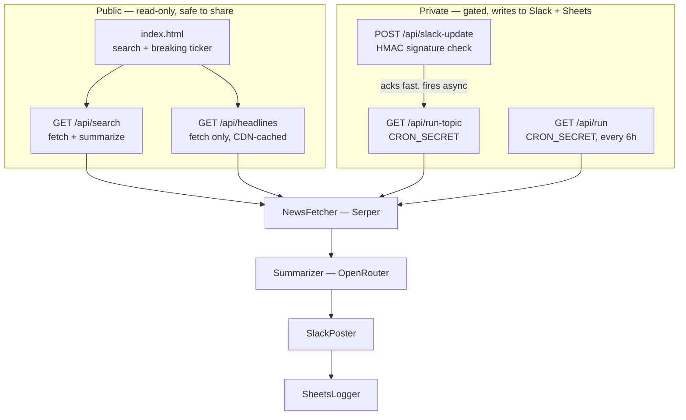

# Newsly.AI

Live news on any topic, distilled to a one-sentence brief.

Newsly.AI has two faces. A **public web UI** anyone can search — it only ever reads.
And a **private Slack command** that runs the real pipeline, posting briefs to a
channel and logging them to a Google Sheet. Keeping those apart is the whole
security design: the page you can hand to a stranger cannot write anywhere.

---

## How it works



The pipeline is plain sequential function calls, not a CrewAI `Crew`. The order is
fixed and known in advance, so there is nothing for an LLM to decide — an agent
framework would only add dependency weight and a layer between you and the stack
trace. `tools/base.py` mirrors just enough of `crewai.tools.BaseTool` that swapping
the import back in later needs no other change.

### Endpoints

| Endpoint | Auth | Writes? | Purpose |
|---|---|---|---|
| `/` | none | no | The web UI |
| `GET /api/search?topic=` | none | **no** | Fetch + summarize on demand (6 articles) |
| `GET /api/headlines` | none | **no** | Ticker headlines, no LLM, cached 15 min at the edge |
| `POST /api/slack-update` | Slack HMAC | via run-topic | The `/update <topic>` slash command |
| `GET /api/run-topic?topic=` | `CRON_SECRET` | **yes** | Full pipeline for one ad-hoc topic |
| `GET /api/run` | `CRON_SECRET` | **yes** | Cron job, every 6h over `NEWS_TOPICS` |

Two details worth knowing:

- **`/api/headlines` is CDN-cached** (`s-maxage=900`). The ticker runs on every page
  load, so without caching each visitor would burn a Serper call. With it, a thousand
  visitors cost about one call per 15 minutes.
- **`/api/slack-update` never runs the pipeline inline.** Slack demands an ack within
  3 seconds and a real run takes far longer, so it verifies the signature, fires a
  fire-and-forget call to `/api/run-topic`, and acks immediately.

---

## Setup

Requires Python 3.11+.

```bash
python -m venv .venv
.venv/Scripts/pip install -r requirements.txt
.venv/Scripts/pip install -e .
cp .env.example .env    # then fill it in
```

Run it locally — `dev_server.py` mimics Vercel's routing (static page + the API
routes) so the UI works end to end without the Vercel CLI:

```bash
.venv/Scripts/python dev_server.py
```

Then open <http://localhost:8000>. Serve it over HTTP like this rather than opening
`index.html` from disk — on `file://` the relative `/api/...` calls cannot resolve and
every request fails.

To run the **full** pipeline once from the CLI (this posts to Slack and writes to your
Sheet for real):

```bash
.venv/Scripts/python -m newsbot.main AI
```

### Environment variables

| Variable | Required | Notes |
|---|---|---|
| `SERPER_API_KEY` | yes | News search. Free key at [serper.dev](https://serper.dev) |
| `OPENROUTER_API_KEY` | yes | Summarization |
| `OPENROUTER_MODEL` | no | Defaults to `google/gemma-4-26b-a4b-it:free`. Free slugs rotate — check [openrouter.ai/api/v1/models](https://openrouter.ai/api/v1/models) |
| `SLACK_BOT_TOKEN` | for posting | Bot token, `xoxb-…` |
| `SLACK_CHANNEL_ID` | for posting | Invite the bot to the channel or posts fail |
| `SLACK_SIGNING_SECRET` | for `/update` | Slack app → Basic Information → App Credentials |
| `GOOGLE_SHEETS_CREDENTIALS_JSON` | for logging | Local: path to the keyfile. Vercel: paste the JSON content itself |
| `GOOGLE_SHEET_ID` | for logging | The id from the sheet URL |
| `NEWS_TOPICS` | no | Comma-separated topics for the cron. Defaults to `AI` |
| `CRON_SECRET` | **yes in production** | Gates the write endpoints — see the warning below |

> [!WARNING]
> `/api/run` only enforces the bearer check **when `CRON_SECRET` is set**. Leave it
> unset in production and anyone who finds the URL can trigger a run that posts to
> your Slack and writes to your Sheet. Always set it.

### Google Sheets

The service account authenticates via `google-auth` and one raw REST call — no
`google-api-python-client`, which drags in httplib2/protobuf for what is a single
request once you hold a token.

**Share the sheet with the service account's email**, or every write returns 403.
Rows are appended to `Sheet1!A:D`:

| A | B | C | D |
|---|---|---|---|
| Date (UTC, ISO) | Headline | Summary | Source URL |

Column D doubles as the dedup key: `run_pipeline` reads `Sheet1!D2:D` before fetching
and skips anything already logged, which is what makes the 6-hourly cron idempotent
*across* runs rather than only within one.

---

## Deploying to Vercel

Order matters — the Slack setup needs a real URL, so do it last.

1. Push to GitHub and import the repo into Vercel.
2. Add every variable above under **Settings → Environment Variables**, then redeploy
   so they take effect. For `GOOGLE_SHEETS_CREDENTIALS_JSON`, paste the file's JSON
   contents, not a path.
3. Confirm the deploy: the page should load and the ticker should populate.
4. Set up the Slack command against your live domain (below).

`vercel.json` registers the 6-hourly cron and the per-function timeouts. Vercel serves
`index.html` and the `api/*.py` handlers natively; `dev_server.py` is local-only.

### Slack `/update` command

1. At [api.slack.com/apps](https://api.slack.com/apps), open your app — or create one
   with **Create New App → From scratch**.
2. **Basic Information → App Credentials → Signing Secret → Show.** Copy it into
   Vercel as `SLACK_SIGNING_SECRET` and redeploy.
3. **Slash Commands → Create New Command:**
   - Command: `/update`
   - Request URL: `https://<your-domain>/api/slack-update`
   - Usage hint: `<topic>`
4. **Install App → Reinstall to Workspace.**
5. Invite the bot to your channel, then try `/update AI`.

Signature verification matters here: without it, anyone who found the URL could POST
directly and drive your Slack channel and Sheet. The check also rejects requests whose
timestamp is more than 5 minutes old, which blocks replays.

---

## Testing

```bash
.venv/Scripts/python -m pytest
```

15 tests, all mocked — no network, no API keys needed. They cover the retry/backoff
rules, per-article failure isolation, Slack's habit of returning HTTP 200 on failure,
and the Sheets dedup path.

---

## Known limits

**The free OpenRouter tier allows 50 model requests per day.** Once exhausted, every
summary fails with a 429. The app degrades rather than breaking: articles still come
back with headline, source, and working link, the status line reads *"summaries
unavailable right now"*, and a circuit breaker stops calling the LLM after two
consecutive failures instead of burning retries against a wall. Adding credits raises
the ceiling to 1000/day.

**Summaries are built from Serper's snippet, not the full article.** So the summarizer
tightens a short excerpt rather than reading the piece. Fixing that means fetching and
parsing each source page — a real dependency and a real new failure surface,
deliberately out of scope.

**`/api/search` runs inside Vercel's 60-second function cap.** The circuit breaker is
what keeps a rate-limited run inside that budget; a timeout surfaces in the UI as a
plain "took too long" message rather than a raw parse error.

**`requirements.txt` includes `pytest`**, which only tests need. Harmless, but it does
ship to production.
